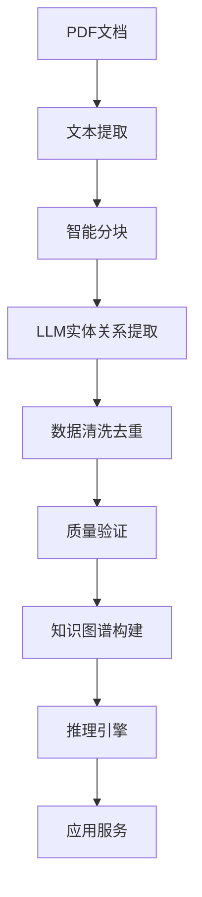

# 滑动轴承工艺知识图谱数据集

[](https://opensource.org/licenses/MIT)
[](https://www.python.org/downloads/)


**Sliding Bearing Process Knowledge Graph Dataset**

一个专用于滑动轴承制造工艺的知识图谱数据集。

## 项目简介

本项目提供了滑动轴承工艺领域的结构化知识图谱数据集，通过大语言模型自动从工艺文档中提取实体和关系，构建标准化的工艺知识库。该数据集可用于工艺推理、知识问答、智能制造等研究领域。

## 数据集结构

```
滑动轴承工艺知识图谱/
├── dataset/                          # 核心数据集
│   ├── bearing_process_entities.csv  # 工艺实体数据
│   └── bearing_process_relations.csv # 工艺关系数据
├── processing.py                       # 处理方法
└── README.md                        # 本文件
```

## 数据集统计

| 类别 | 数量 | 说明 |
|------|------|------|
| 工艺实体 | 2238 | 产品、工艺过程、资源、材料、质量实体 |
| 工艺关系 | 679 | 加工、使用、包含、顺序、质量、参数关系 |
| 文档来源 | 100+ | 工艺规程、技术标准、研究论文 |

## 🚀 快速开始

### 环境要求

- Python 3.8+
- 依赖库: `pandas`, `networkx`, `httpx`, `tiktoken`, `PyMuPDF`

### 安装

```bash
# 设置API密钥（用于数据构建）
export SILICON_TOKEN="your_api_key_here"
```


### 核心组件
 - 自动PDF文本提取
 - 基于LLM的实体关系识别
 - 智能去重和质量控制


### 数据处理流程



## 📋 数据格式

### 实体数据格式

```csv
entity_id,entity_text,entity_type,confidence,attributes,source_file,content_hash,create_time
E_12345678,离心铸造,工艺过程实体,0.95,"{""category"": ""加工方法""}",paper1.pdf,abc123,2025-01-01T12:00:00
```

| 字段 | 类型 | 说明 |
|------|------|------|
| entity_id | String | 实体唯一标识符 |
| entity_text | String | 实体文本内容 |
| entity_type | String | 实体类型（5大类） |
| confidence | Float | 置信度 (0-1) |
| attributes | JSON | 实体属性信息 |
| source_file | String | 来源文档 |
| content_hash | String | 内容哈希（去重用） |
| create_time | DateTime | 创建时间 |

### 关系数据格式

```csv
relation_id,source_entity,target_entity,relation_type,confidence,attributes,source_file,content_hash,create_time
R_87654321,离心铸造,减摩层,加工关系,0.9,"{""direction"": ""工序-零件""}",paper1.pdf,def456,2025-01-01T12:00:00
```

## 技术细节

### 本体模型

工艺本体模型基于制造业标准和专家知识构建，包含：

- **产品层次**: 产品→零件→特征
- **工艺层次**: 工艺→工序→工步  
- **资源层次**: 设备→工装→工具
- **质量层次**: 标准→要求→检测

### 提取算法

1. **文本预处理**: 清洗、分词、标准化
2. **实体识别**: 基于上下文的命名实体识别
3. **关系抽取**: 依存分析+模式匹配
4. **知识融合**: 多源数据对齐和去重

### 质量控制

- **置信度评估**: 基于上下文相关性
- **一致性检查**: 本体约束验证
- **专家评审**: 人工抽样验证
- **交叉验证**: 多源数据对比

## 📈 应用场景

### 1. 工艺设计辅助
```python
# 为新零件推荐工艺方案
part = {"material": "铸铁", "feature": "内径φ50"}
processes = engine.recommend_processes(part)
```

### 2. 质量分析
```python
# 分析缺陷与工艺的关联
defects = kg.get_related_entities("黑色斑点", relation_type="质量关系")
```

### 3. 知识问答
```python
# 回答工艺相关问题
answer = qa_system.answer("巴氏合金离心铸造的温度是多少？")
```

### 4. 工艺优化
```python
# 优化工艺参数
optimized = optimizer.optimize_parameters(process="离心铸造", target="质量")
```

## 致谢

感谢以下组织的支持：

- 浙江申科滑动轴承科技有限公司
- 诸暨市鸿源电力机械有限公司
- 香港科技大学红鸟挑战营

---

**关键词**: 知识图谱, 滑动轴承, 工艺数据, 大语言模型, 智能制造, 数据挖掘, 本体建模

**Keywords**: Knowledge Graph, Sliding Bearing, Process Data, Large Language Model, Intelligent Manufacturing, Data Mining, Ontology Modeling
